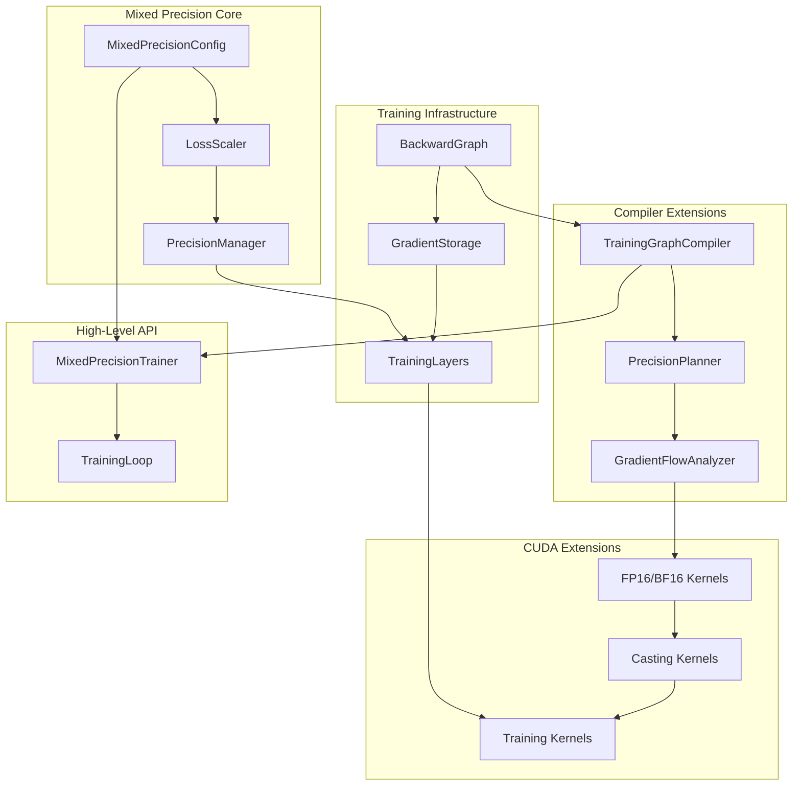

# Mixed-Precision Training Implementation Plan

## Overview

This document outlines the comprehensive plan to add mixed-precision (FP16/BF16) training support with automatic mixed precision and loss scaling to the adaptive-node CUDA framework.

## Current State Analysis

The codebase has:
- **Strong Foundation**: Universal CUDA graph engine with dynamic compilation
- **Inference-Only**: Forward pass implementations for transformers, attention, embeddings
- **FP32 Operations**: All current operations use float32 precision
- **Mock Runtime**: Uses MockCudaRuntime for development/testing
- **No Training Infrastructure**: Missing backward passes, optimizers, loss functions

## Mixed-Precision Training Implementation Plan

### 1. Core Mixed-Precision Infrastructure

**A. Precision Management System**
- Create `MixedPrecisionConfig` class to manage FP16/BF16 settings
- Add precision tracking to `CudaTensor` interface (extend dtype support)
- Implement automatic precision casting utilities
- Add precision-aware memory allocation

**B. Loss Scaling Manager**
- Implement `LossScaler` class with dynamic and static scaling
- Add gradient overflow detection
- Implement scale adjustment logic (increase/decrease based on overflow)
- Integration with backward pass execution

### 2. Training Infrastructure Extensions

**A. Backward Pass System**
- Extend `CudaNode` to support backward operations
- Create backward pass graph generation from forward graph
- Implement gradient accumulation and storage
- Add automatic differentiation utilities

**B. Training Layers**
- Extend existing layers (`DenseLayer`, `MultiHeadAttentionLayer`, etc.) with backward methods
- Implement mixed-precision forward/backward kernels
- Add gradient computation for each layer type

### 3. CUDA Kernel Enhancements

**A. Mixed-Precision Kernels**
- Implement FP16/BF16 versions of existing operations
- Add automatic casting kernels (FP32 ↔ FP16/BF16)
- Optimize memory bandwidth with half-precision storage
- Maintain FP32 master weights for stability

**B. Training-Specific Kernels**
- Loss computation kernels (CrossEntropy, MSE with mixed precision)
- Gradient clipping and scaling kernels
- Optimizer kernels (Adam, SGD with mixed precision)

### 4. Graph Compiler Extensions

**A. Training Graph Compilation**
- Extend `CudaGraphCompiler` to handle backward graphs
- Implement precision planning (which ops use FP16 vs FP32)
- Add gradient flow analysis
- Memory optimization for training (gradient storage)

**B. Automatic Mixed Precision Logic**
- Whitelist/blacklist operations for FP16 usage
- Automatic insertion of casting operations
- Loss scaling integration in compiled kernels

### 5. High-Level Training API

**A. Training Manager**
```typescript
class MixedPrecisionTrainer {
  // Configure automatic mixed precision settings
  // Manage loss scaling
  // Coordinate forward/backward passes
  // Handle optimizer updates
}
```

**B. Training Loop Integration**
- Extend `LanguageModel` with training capabilities
- Add loss computation and backpropagation
- Implement gradient accumulation across batches

## Implementation Architecture



## Key Files to Create/Modify

### New Files:
1. `src/cuda-work/training/mixed-precision.ts` - Core MP infrastructure
2. `src/cuda-work/training/loss-scaling.ts` - Loss scaling management
3. `src/cuda-work/training/backward-graph.ts` - Backward pass system
4. `src/cuda-work/training/training-layers.ts` - Training-enabled layers
5. `src/cuda-work/training/optimizers.ts` - Mixed-precision optimizers
6. `src/cuda-work/training/trainer.ts` - High-level training API

### Modified Files:
1. `src/cuda-work/cuda-abstractions.ts` - Add FP16/BF16 tensor support
2. `src/cuda-work/cuda-graph.ts` - Extend for backward graphs
3. `src/cuda-work/neural-network.ts` - Add training capabilities
4. `src/cuda-work/llm/language-model.ts` - Training integration

## Benefits of This Approach

1. **Memory Efficiency**: ~50% memory reduction with FP16
2. **Speed Improvements**: 1.5-2x training speedup on modern GPUs
3. **Numerical Stability**: Loss scaling prevents gradient underflow
4. **Backward Compatibility**: Existing inference code unchanged
5. **Flexibility**: Support both FP16 and BF16 based on hardware

## Implementation Phases

**Phase 1**: Core mixed-precision infrastructure and loss scaling
**Phase 2**: Backward pass system and gradient computation
**Phase 3**: Mixed-precision CUDA kernels
**Phase 4**: Training graph compilation
**Phase 5**: High-level training API and integration testing

## Technical Details

### Mixed-Precision Strategy

1. **Forward Pass**: Use FP16 for most operations, FP32 for numerically sensitive ops
2. **Backward Pass**: Compute gradients in FP16, accumulate in FP32
3. **Master Weights**: Keep FP32 copies of weights for optimizer updates
4. **Loss Scaling**: Scale loss to prevent gradient underflow in FP16

### Automatic Mixed Precision Rules

**FP16 Safe Operations:**
- Matrix multiplications (GEMM)
- Convolutions
- Element-wise operations (ReLU, Add, etc.)
- Attention computations

**FP32 Required Operations:**
- Loss computation
- Softmax (for numerical stability)
- Layer normalization
- Gradient accumulation

### Loss Scaling Implementation

```typescript
interface LossScaler {
  scale: number;
  growthFactor: number;
  backoffFactor: number;
  growthInterval: number;
  
  scaleGradients(gradients: CudaTensor[]): void;
  unscaleGradients(gradients: CudaTensor[]): boolean; // returns hasOverflow
  updateScale(hasOverflow: boolean): void;
}
```

## Memory Layout Optimization

### Tensor Storage Strategy
- **Activations**: Store in FP16 during forward pass
- **Gradients**: Compute in FP16, accumulate in FP32
- **Parameters**: Master weights in FP32, working copies in FP16
- **Optimizer States**: Always FP32 for numerical stability

### Memory Bandwidth Optimization
- Minimize FP32 ↔ FP16 conversions
- Batch casting operations
- Use tensor cores for FP16 matrix operations
- Optimize memory access patterns

## Testing Strategy

1. **Unit Tests**: Individual mixed-precision operations
2. **Integration Tests**: End-to-end training with loss scaling
3. **Numerical Tests**: Compare FP32 vs mixed-precision convergence
4. **Performance Tests**: Memory usage and speed benchmarks
5. **Stability Tests**: Long training runs with dynamic loss scaling

## Future Enhancements

1. **BF16 Support**: Add bfloat16 for better numerical range
2. **Tensor Core Optimization**: Leverage specialized hardware
3. **Gradient Compression**: Further memory optimization
4. **Multi-GPU Training**: Distributed mixed-precision training
5. **Dynamic Precision**: Runtime precision adjustment based on training phase
