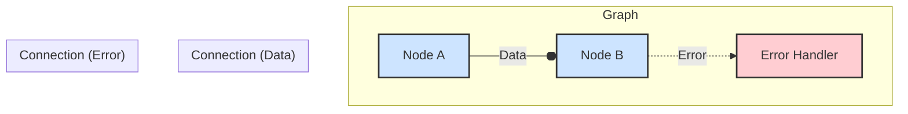

# Adaptive Node

[](https://www.npmjs.com/package/adaptive-node)
[](https://github.com/your-username/adaptive-node/blob/main/LICENSE)

Adaptive Node is a powerful and flexible TypeScript library for building dynamic, graph-based data processing pipelines in Node.js. It provides a robust framework for creating complex, resilient, and high-performance systems with features like type-safe connections, automatic error handling, and advanced flow control.

## Key Features

- **Graph-Based Architecture**: Visually design and manage complex data flows as a graph of interconnected nodes.
- **Type-Safe Connections**: Leverage TypeScript generics to ensure data integrity between nodes at compile time.
- **Advanced Error Handling**: Built-in circuit breaker and dedicated error outlets to create resilient pipelines.
- **Flow Control**: Manage processing loads with concurrency limits and request queuing.
- **Dynamic & Adaptive**: Nodes can adapt their behavior based on the type of input data they receive.
- **Extensible**: Easily create custom processing nodes to fit any application logic.
- **Rich Node Library**: Includes a wide array of pre-built nodes for math, logic, data flow, caching, load balancing, and more.
- **Performance Monitoring**: Track the performance of individual nodes to identify bottlenecks.
- **Sub-Graph Support**: Encapsulate complex logic into reusable sub-graphs.

## Architecture Overview

The library is built on three core concepts:

1.  **`AdaptiveNode`**: The fundamental processing unit. Each node encapsulates a specific piece of logic, has defined inlets and outlets, and can be configured with features like error handling and flow control.
2.  **`Graph`**: A container that manages a collection of nodes and their connections. The graph is responsible for executing the data processing pipeline, either sequentially or in parallel.
3.  **`Connection`**: A type-safe link between an outlet of one node and an inlet of another, defining the path of data flow. Connections can optionally include a transformer to modify data in transit.

### Architecture Diagram

This diagram illustrates the relationship between the core components:



## Installation

```bash
npm install adaptive-node
```

## Usage

Here's how to create and execute a simple processing graph:

```typescript
import { Graph, createProcessor } from 'adaptive-node';

// 1. Create a new graph instance
const graph = new Graph();

// 2. Create processing nodes
// Each node is a simple function that takes an input and returns an output.
const inputNode = createProcessor<number, number>((x) => x, 'input');
const add5Node = createProcessor<number, number>((x) => x + 5, 'add5');
const multiply2Node = createProcessor<number, number>((x) => x * 2, 'multiply2');
const outputNode = createProcessor<number, void>(
  (x) => console.log('Result:', x),
  'output'
);

// 3. Add nodes to the graph
graph
  .addNode(inputNode)
  .addNode(add5Node)
  .addNode(multiply2Node)
  .addNode(outputNode);

// 4. Connect the nodes to define the data flow: (input + 5) * 2
graph.connect(inputNode, add5Node);
graph.connect(add5Node, multiply2Node);
graph.connect(multiply2Node, outputNode);

// 5. Execute the graph with an initial value
async function run() {
  await graph.execute(10, inputNode.id); // Expected output: Result: 30
}

run();
```

## Advanced Example: Type-Adaptive Processing

Nodes can be registered with different processors for different data types, allowing them to adapt their behavior dynamically.

```typescript
import { AdaptiveNode, createProcessor, Graph } from 'adaptive-node';

// This node provides different logic for numbers, strings, and arrays
const smartProcessor = new AdaptiveNode<any, string>(
  (input) => `Unknown type: ${typeof input}`
)
  .register(Number, (num) => `Number: ${num.toFixed(2)}`)
  .register(String, (str) => `String: "${str.toUpperCase()}"`)
  .register(Array, (arr) => `Array[${arr.length}]: ${arr.join(', ')}`)
  .setLabel('smart-processor');

const logger = createProcessor<string, void>((msg) => console.log(msg), 'logger');

const graph = new Graph();
graph.addNode(smartProcessor).addNode(logger);
graph.connect(smartProcessor, logger);

// Process different data types
async function run() {
  await smartProcessor.process(42);         // Logs: Number: 42.00
  await smartProcessor.process('hello');    // Logs: String: "HELLO"
  await smartProcessor.process([1, 2, 3]);  // Logs: Array[3]: 1, 2, 3
}

run();
```

## Available Nodes

The library includes a rich set of pre-built nodes, including:
- **Math**: `createAddNode`, `createMultiplyNode`, etc.
- **Logic**: `createConditionalNode`, `createAndNode`, `createNotNode`, etc.
- **Data Flow**: `createGateNode`, `createMergeNode`, `createSplitNode`.
- **Routing**: `createRouterNode`, `createLoadBalancerNode`.
- **Time-based**: `createDelayNode`, `createThrottleNode`, `createDebounceNode`.
- **Error Handling**: `createErrorLoggerNode`, `createErrorRecoveryNode`.
- **And many more...**

## Running Tests

The project includes a comprehensive suite of demos that also serve as tests. To build and run them:

```bash
# Run basic tests
npm run test-basics

# Run tests with improvements
npm run test-improvements
```

## Contributing

Contributions are welcome! Please feel free to submit a pull request or open an issue.

1.  Fork the repository.
2.  Create your feature branch (`git checkout -b feature/AmazingFeature`).
3.  Commit your changes (`git commit -m 'Add some AmazingFeature'`).
4.  Push to the branch (`git push origin feature/AmazingFeature`).
5.  Open a pull request.

## License

This project is licensed under the MIT License - see the [LICENSE](LICENSE) file for details.
