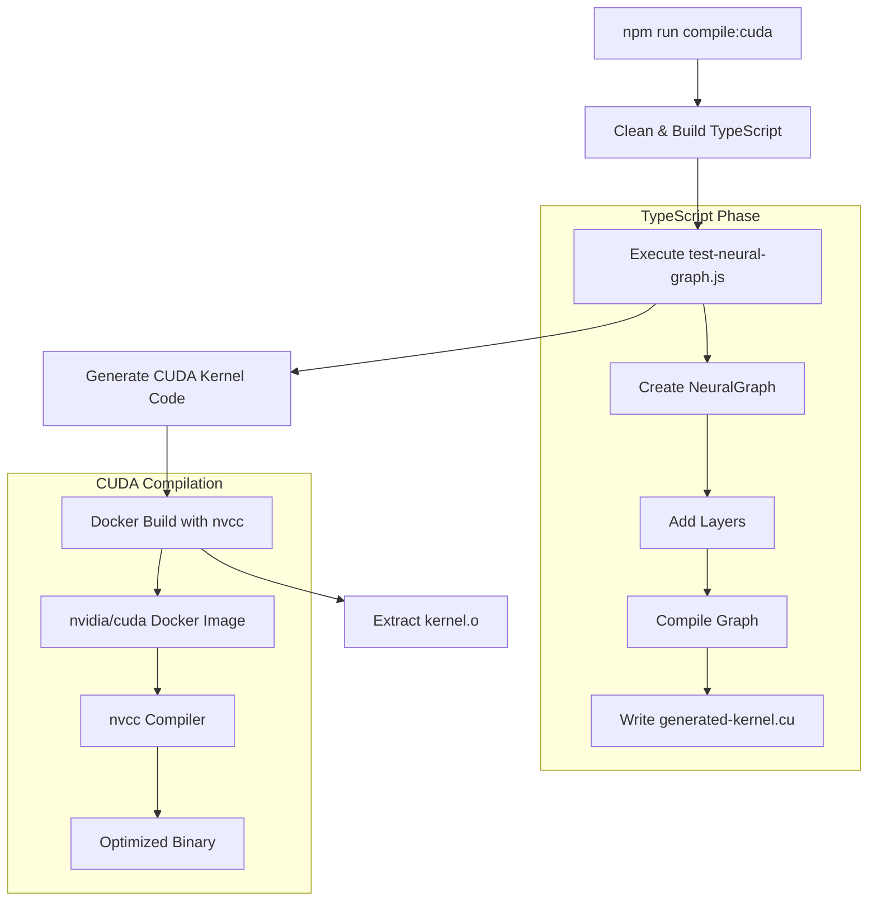
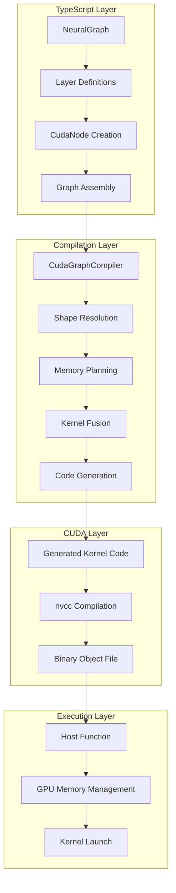
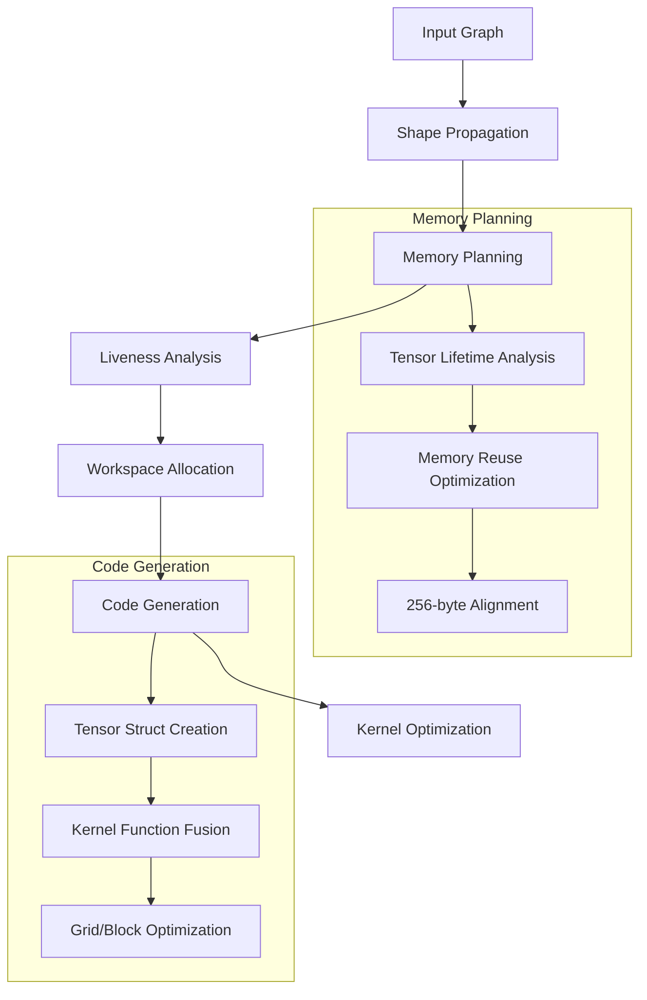
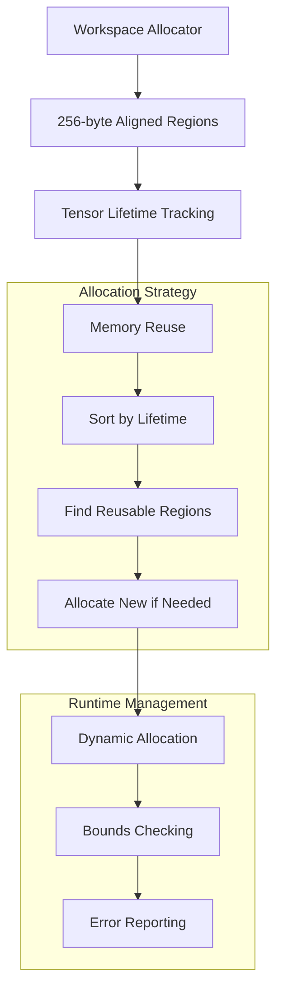
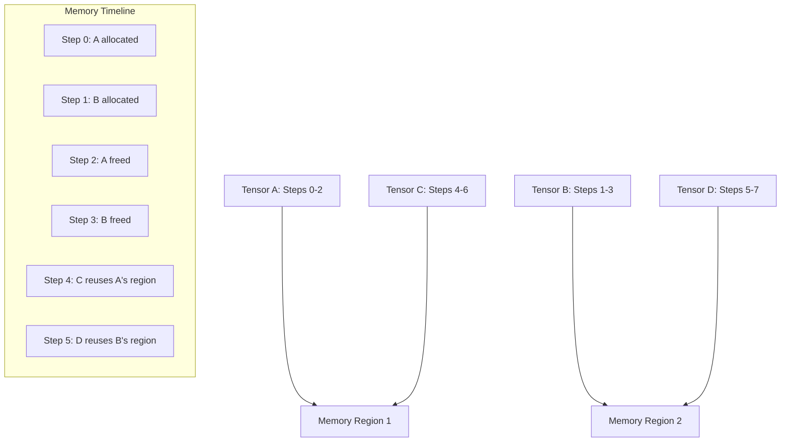

# TypeScript to CUDA-C++ Library Guide

A sophisticated system for defining computation graphs in TypeScript, compiling them down to optimized CUDA C++ kernels, and executing them on GPU hardware.

## Table of Contents

- [Overview](#overview)
- [Quick Start](#quick-start)
- [Usage](#usage)
- [Architecture](#architecture)
- [Features](#features)
- [API Reference](#api-reference)
- [Examples](#examples)
- [Advanced Topics](#advanced-topics)

## Overview

This library provides a complete toolchain for building high-performance GPU-accelerated applications using TypeScript. It bridges the gap between high-level neural network definitions and low-level CUDA kernel execution through:

- **Graph-based computation**: Define complex neural networks as computation graphs
- **Automatic kernel fusion**: Multiple operations are fused into single, optimized CUDA kernels
- **Memory optimization**: Intelligent workspace allocation with tensor reuse
- **Type safety**: Full TypeScript support with compile-time shape checking
- **Docker-based compilation**: Reproducible CUDA compilation environment

### Key Benefits

- 🚀 **Performance**: Fused kernels eliminate intermediate memory transfers
- 🔧 **Flexibility**: Domain-agnostic graph engine supports any CUDA-accelerated workload
- 🛡️ **Safety**: Comprehensive bounds checking and error handling
- 📦 **Portability**: Docker-based compilation works across different environments
- 🎯 **Optimization**: Automatic memory planning and tensor lifecycle management

## Quick Start

### Prerequisites

- Node.js 18+
- Docker with NVIDIA Container Toolkit
- NVIDIA GPU with CUDA support

### Basic Example

```bash
# Compile a neural network to CUDA
npm run compile:cuda

# With custom block size
npm run compile:cuda -- --bs=512
```

This generates:
- `generated-kernel.cu` - CUDA C++ source code
- `dist/kernel.o` - Compiled binary object file

## Usage

### Primary Command

```bash
npm run compile:cuda [options]
```

### Block Size Parameter (`bs`)

The `--bs` (or `--block-size`) parameter controls CUDA thread block dimensions:

```bash
# Default block size (256)
npm run compile:cuda

# Custom block size
npm run compile:cuda -- --bs=512
npm run compile:cuda -- --block-size=1024
```

**Parameter Constraints:**
- **Range**: 1 to 1024
- **Alignment**: Must be multiple of 32 (CUDA warp size)
- **Default**: 256
- **Recommended**: 256, 512, or 1024 depending on your GPU architecture

**Block Size Guidelines:**
- **256**: Good general-purpose default, works well on most GPUs
- **512**: Better for compute-intensive kernels with high arithmetic intensity
- **1024**: Maximum occupancy for kernels with low register usage
- **Custom**: Use GPU profiling tools to determine optimal size for your specific workload

### Compilation Pipeline



## Architecture

### High-Level Architecture



### Core Components

#### 1. CudaNode - Atomic GPU Operations

```typescript
class CudaNode {
  deviceCode: string;        // CUDA C++ kernel code
  inputs: Map<string, TensorSpec>;   // Named input ports
  outputs: Map<string, TensorSpec>;  // Named output ports
  parameters: Map<string, CudaTensor>; // Weights, biases, etc.
}
```

**Features:**
- Named input/output ports for complex graph topologies
- Dynamic shape resolution
- Parameter management for stateful operations
- Automatic bounds checking code generation

#### 2. CudaGraph - Computation Graph

```typescript
class CudaGraph {
  nodes: Map<string, CudaNode>;
  connections: Set<GraphConnection>;
  
  // Automatic topological sorting
  getExecutionOrder(): CudaNode[];
}
```

**Features:**
- Directed Acyclic Graph (DAG) structure
- Automatic cycle detection
- Topological sorting for execution order
- Graph input/output identification

#### 3. CudaGraphCompiler - Kernel Fusion Engine

```typescript
class CudaGraphCompiler {
  compile(graph: CudaGraph, inputShapes: Map<string, number[]>): {
    kernel: CudaKernel;
    parameters: CudaTensor[];
    kernelCode: string;
    workspaceSize: number;
  }
}
```

**Compilation Process:**



### Memory Management Architecture



## Features

### Core Engine Features

#### 1. Universal Graph Engine
- **Domain Agnostic**: Not limited to neural networks - supports any CUDA-accelerated computation
- **Flexible Topology**: Support for complex, non-linear graph structures
- **Dynamic Shapes**: Runtime shape resolution with batch size propagation

#### 2. Automatic Kernel Fusion
```cuda
// Instead of multiple kernel launches:
kernel1<<<grid1, block1>>>(input, temp1);
kernel2<<<grid2, block2>>>(temp1, temp2);
kernel3<<<grid3, block3>>>(temp2, output);

// Generates single fused kernel:
fusedKernel<<<optimizedGrid, optimizedBlock>>>(input, output, workspace);
```

#### 3. Intelligent Memory Management
- **Workspace Planning**: Pre-calculated memory requirements
- **Tensor Reuse**: Automatic reuse of memory regions when tensor lifetimes don't overlap
- **Alignment Optimization**: 256-byte alignment for optimal GPU memory access
- **Bounds Checking**: Comprehensive runtime bounds validation

### Neural Network Components

#### Basic Layers

**Dense Layer (Fully Connected)**
```typescript
const denseLayer = new DenseLayer(runtime, inputFeatures, outputFeatures);
```
- Supports both 2D `[batch, features]` and 3D `[batch, sequence, features]` tensors
- Automatic kernel selection based on input dimensionality
- Optimized matrix multiplication with bias addition

**ReLU Activation**
```typescript
const reluLayer = new ReLULayer();
```
- Element-wise activation function: `f(x) = max(0, x)`
- Dynamic size calculation
- Optimized for various tensor shapes

**Softmax Layer**
```typescript
const softmaxLayer = new SoftmaxLayer();
```
- Numerically stable implementation with max subtraction
- Supports both 2D and 4D tensors
- Parallel reduction for sum calculation

#### Advanced LLM Components

**Multi-Head Attention**
```typescript
const attention = new MultiHeadAttentionLayer(runtime, embedDim, numHeads);
```
- Complete scaled dot-product attention implementation
- Automatic head splitting and concatenation
- Optimized batched matrix multiplication

**Layer Normalization**
```typescript
const layerNorm = new LayerNormLayer(runtime, normalizedShape, epsilon);
```
- Parallel mean and variance calculation
- Shared memory optimization for reduction operations
- Configurable epsilon for numerical stability

**Transformer Block**
```typescript
const transformer = new TransformerBlock(runtime, embedDim, numHeads, ffnHiddenDim);
```
- Complete transformer architecture with residual connections
- Multi-head attention + feed-forward network
- Layer normalization and skip connections

#### Specialized Operations

**Fused Scale-Softmax**
```typescript
const fusedScaleSoftmax = new FusedScaleSoftmaxLayer(scale);
```
- Combines scaling and softmax in single kernel
- Reduces memory bandwidth requirements
- Optimized for attention score computation

**Embedding Layer**
```typescript
const embedding = new EmbeddingLayer(runtime, vocabSize, embedDim, maxLen);
```
- Token embedding lookup with positional encoding
- Efficient GPU memory access patterns
- Support for variable sequence lengths

### Performance Optimizations

#### 1. Grid and Block Size Optimization
The compiler automatically calculates optimal CUDA grid and block dimensions based on:
- Tensor shapes and sizes
- Kernel type and memory access patterns
- Target GPU architecture constraints

```typescript
// Example optimizations:
// Dense layers: Grid(outputFeatures/blockSize, batchSize)
// Softmax: Grid(batchSize) with shared memory reduction
// Attention: Grid(seqLen, numHeads, batchSize)
```

#### 2. Memory Access Optimization
- **Coalesced Access**: Memory access patterns optimized for GPU memory hierarchy
- **Shared Memory**: Reduction operations use shared memory for efficiency
- **Bank Conflict Avoidance**: Careful indexing to avoid shared memory bank conflicts

#### 3. Warp-Level Optimizations
- **Shuffle Instructions**: Use `__shfl_down_sync` for efficient intra-warp reductions
- **Warp-Synchronous Programming**: Optimized for 32-thread warp execution
- **Divergence Minimization**: Control flow designed to minimize warp divergence

## API Reference

### Core Classes

#### CudaNode
```typescript
class CudaNode {
  constructor(deviceCode: string, functionName: string);
  
  addInput(name: string, shape: number[], dtype: string): this;
  addOutput(name: string, shape: number[], dtype: string): this;
  addParameter(name: string, tensor: CudaTensor): this;
  setShapeResolver(resolver: ShapeResolver): this;
}
```

#### CudaGraph
```typescript
class CudaGraph {
  constructor(name?: string);
  
  addNode(node: CudaNode): this;
  connect(fromNode: CudaNode, fromPort: string, 
          toNode: CudaNode, toPort: string): this;
  getExecutionOrder(): CudaNode[];
}
```

#### NeuralGraph
```typescript
class NeuralGraph extends CudaGraph {
  addLayer(layer: Layer, ...inputs: CudaNode[]): CudaNode;
}
```

### Layer Implementations

#### Basic Layers
- `DenseLayer(runtime, inputFeatures, outputFeatures)`
- `ReLULayer()`
- `SoftmaxLayer()`

#### LLM Layers
- `MultiHeadAttentionLayer(runtime, embedDim, numHeads)`
- `LayerNormLayer(runtime, normalizedShape, epsilon?)`
- `EmbeddingLayer(runtime, vocabSize, embedDim, maxLen)`
- `PositionalEncodingLayer(runtime, maxLen, embedDim)`
- `TransformerBlock(runtime, embedDim, numHeads, ffnHiddenDim)`

#### Utility Layers
- `AddLayer()` - Element-wise addition with broadcasting
- `FusedScaleSoftmaxLayer(scale)` - Combined scaling and softmax

### Runtime Abstractions

#### CudaRuntime Interface
```typescript
interface CudaRuntime {
  malloc(size: number, shape?: number[], dtype?: string): Promise<CudaTensor>;
  memcpyHostToDevice(dst: CudaTensor, src: Buffer): Promise<void>;
  compile(kernelCode: string): Promise<CudaKernel>;
}
```

#### MockCudaRuntime
Development-time implementation that:
- Simulates GPU operations without hardware
- Logs all operations for debugging
- Enables kernel code generation and testing

## Examples

### Simple Neural Network

```typescript
import { MockCudaRuntime } from "./cuda-abstractions";
import { CudaGraphCompiler } from "./cuda-graph";
import { NeuralGraph, DenseLayer, ReLULayer } from "./neural-network";

async function createSimpleNetwork() {
  const runtime = new MockCudaRuntime();
  const compiler = new CudaGraphCompiler(runtime, 256); // Block size 256
  
  // Create network
  const model = new NeuralGraph("SimpleMLP");
  const dense1 = new DenseLayer(runtime, 784, 256);
  const relu = new ReLULayer();
  const dense2 = new DenseLayer(runtime, 256, 10);
  
  // Initialize parameters
  await dense1.initialize();
  await dense2.initialize();
  
  // Build graph
  const inputNode = new CudaNode("", "input_node")
    .addOutput('output', [64, 784], 'float32'); // Batch size 64
  
  model.addNode(inputNode);
  model.addLayer(dense1, inputNode);
  model.addLayer(relu);
  model.addLayer(dense2);
  
  // Compile to CUDA
  const inputShapes = new Map([["output", [64, 784]]]);
  const { kernel, parameters, kernelCode, workspaceSize } = 
    await compiler.compile(model, inputShapes);
  
  console.log(`Generated kernel with ${parameters.length} parameters`);
  console.log(`Workspace size: ${workspaceSize} bytes`);
  
  // Save kernel code
  fs.writeFileSync('generated-kernel.cu', kernelCode);
}
```

### Complete Language Model

```typescript
import { LanguageModel } from "./llm/language-model";

async function createLanguageModel() {
  const runtime = new MockCudaRuntime();
  
  // Model configuration
  const config = {
    vocabSize: 50000,
    embedDim: 512,
    numHeads: 8,
    numLayers: 6,
    ffnHiddenDim: 2048,
    maxLen: 1024
  };
  
  // Create and initialize model
  const model = new LanguageModel(
    runtime,
    config.vocabSize,
    config.embedDim,
    config.numHeads,
    config.numLayers,
    config.ffnHiddenDim,
    config.maxLen
  );
  
  await model.initialize();
  model.build();
  
  // Compile with custom block size
  const compiler = new CudaGraphCompiler(runtime, 512);
  const inputShapes = new Map([["input_ids", [32, 128]]); // Batch=32, SeqLen=128
  
  const result = await compiler.compile(model, inputShapes);
  console.log(`Language model compiled successfully!`);
  console.log(`Workspace required: ${(result.workspaceSize / 1024 / 1024).toFixed(2)} MB`);
}
```

### Custom Layer Development

```typescript
class CustomActivationLayer implements Layer {
  addToGraph(graph: NeuralGraph, ...inputs: CudaNode[]): CudaNode {
    const deviceCode = `
      __global__ void custom_activation_forward(
        Tensor<float> output, 
        Tensor<float> input
      ) {
        int idx = blockIdx.x * blockDim.x + threadIdx.x;
        int total_elements = input.total_elements();
        
        if (idx < total_elements) {
          float x = input.data[idx];
          // Custom activation: Swish (x * sigmoid(x))
          output.data[idx] = x / (1.0f + expf(-x));
        }
      }
    `;
    
    const customNode = new CudaNode(deviceCode, "custom_activation_forward")
      .addInput('input', [-1], 'float32')
      .addOutput('output', [-1], 'float32')
      .setShapeResolver(inputs => {
        const inputShape = inputs.get('input')!.shape;
        return new Map([['output', { shape: inputShape }]]);
      });
    
    graph.addNode(customNode);
    return customNode;
  }
}
```

## Advanced Topics

### Memory Optimization Strategies

#### Workspace Size Calculation
The compiler performs sophisticated memory planning to minimize GPU memory usage:

```typescript
// Memory planning algorithm:
1. Analyze tensor lifetimes across execution order
2. Sort tensors by creation time
3. Find reusable memory regions for non-overlapping lifetimes
4. Align all allocations to 256-byte boundaries
5. Calculate total workspace requirement
```

#### Memory Reuse Example


### Performance Tuning

#### Block Size Selection Guidelines

| Kernel Type | Recommended Block Size | Reasoning |
|-------------|----------------------|-----------|
| Dense Layers | 256-512 | Good balance of occupancy and register usage |
| Softmax | 256-1024 | Depends on sequence length for reduction efficiency |
| Attention | 256 | Complex memory access patterns benefit from smaller blocks |
| Element-wise | 512-1024 | Simple operations can use larger blocks |

#### Profiling Integration
```bash
# Profile with NVIDIA Nsight Compute
ncu --set full --force-overwrite -o profile_report ./your_cuda_app

# Profile with NVIDIA Nsight Systems  
nsys profile --trace=cuda,nvtx -o timeline_report ./your_cuda_app
```

### Debugging and Development

#### Debug Mode Features
The library includes comprehensive debugging capabilities:

```cuda
// Automatic bounds checking (enabled in debug builds)
#ifndef NDEBUG
#define TENSOR_BOUNDS_CHECK 1
#define TENSOR_BOUNDS_CHECK_VERBOSE 1
#endif

// Runtime error reporting
if (idx >= tensor.total_elements()) {
  printf("FATAL: Tensor bounds error at index %d\n", idx);
  asm("trap;"); // Trigger GPU exception
}
```

#### MockCudaRuntime Logging
```typescript
// Enable detailed logging
const runtime = new MockCudaRuntime();
// Logs all operations:
// - Memory allocations with shapes and sizes
// - Kernel compilation requests
// - Data transfer operations
// - Kernel launch parameters
```

### Integration with Existing CUDA Code

#### Host-Side Integration
The generated kernel can be integrated into existing CUDA applications:

```cpp
// Generated function signature
extern "C" void executeGraph(
  float* input_data, const int* input_shape, int input_dims,
  float* output_data, const int* output_shape, int output_dims,
  float* param1_data, const int* param1_shape, int param1_dims,
  // ... more parameters
  char* workspace, size_t workspace_size
);

// Usage in your application
int main() {
  // Allocate GPU memory
  float* d_input, *d_output;
  cudaMalloc(&d_input, batch_size * input_features * sizeof(float));
  cudaMalloc(&d_output, batch_size * output_features * sizeof(float));
  
  // Allocate workspace
  char* d_workspace;
  cudaMalloc(&d_workspace, workspace_size);
  
  // Execute the fused kernel
  executeGraph(d_input, input_shape, 2,
               d_output, output_shape, 2,
               d_weights, weight_shape, 2,
               d_workspace, workspace_size);
  
  cudaDeviceSynchronize();
  return 0;
}
```

### Extending the Library

#### Adding New Layer Types
1. Implement the `Layer` interface
2. Define CUDA kernel code with proper tensor indexing
3. Set up input/output ports and shape resolution
4. Add parameter management if needed

#### Custom Optimization Passes
The compiler architecture supports custom optimization passes:

```typescript
class CustomOptimizationPass {
  optimize(graph: CudaGraph): CudaGraph {
    // Implement custom graph transformations
    // Examples: operator fusion, constant folding, etc.
    return optimizedGraph;
  }
}
```

## Troubleshooting

### Common Issues

#### 1. Block Size Validation Errors
```bash
Error: Block size must be a multiple of 32 (warp size)
```
**Solution**: Use block sizes like 32, 64, 96, 128, 160, 192, 224, 256, 288, 320, etc.

#### 2. Shape Resolution Failures
```bash
Compiler error: Unresolved dynamic shape [-1, -1] for output 'output'
```
**Solution**: Ensure all input shapes are properly specified and shape resolvers are implemented.

#### 3. Memory Allocation Errors
```bash
ERROR: Workspace allocator out of memory
```
**Solution**: The generated kernel requires more workspace memory than allocated. Check the `workspaceSize` returned by the compiler.

#### 4. CUDA Compilation Errors
```bash
nvcc: error: unsupported GPU architecture
```
**Solution**: Ensure your Docker environment has the correct CUDA version for your target GPU.

### Performance Issues

#### 1. Low GPU Utilization
- **Check block sizes**: Ensure blocks are large enough for good occupancy
- **Profile memory access**: Look for uncoalesced memory access patterns
- **Analyze kernel complexity**: Very simple kernels may be memory-bound

#### 2. High Memory Usage
- **Review tensor lifetimes**: Ensure tensors are freed as soon as possible
- **Check for memory leaks**: Verify all allocated tensors are properly managed
- **Optimize workspace usage**: Consider reducing batch sizes or model complexity

## Conclusion

This TypeScript to CUDA-C++ library provides a powerful foundation for building high-performance GPU-accelerated applications. Its graph-based approach, automatic optimization, and comprehensive feature set make it suitable for both research and production use cases.

Key advantages:
- **Developer Productivity**: High-level TypeScript interface with full type safety
- **Performance**: Automatic kernel fusion and memory optimization
- **Flexibility**: Domain-agnostic design supports various computational workloads
- **Maintainability**: Clean separation between graph definition and execution
- **Debuggability**: Comprehensive error checking and logging capabilities

For questions, issues, or contributions, please refer to the project repository and documentation.

---

*Generated documentation for TypeScript to CUDA-C++ Library v1.0.9*
