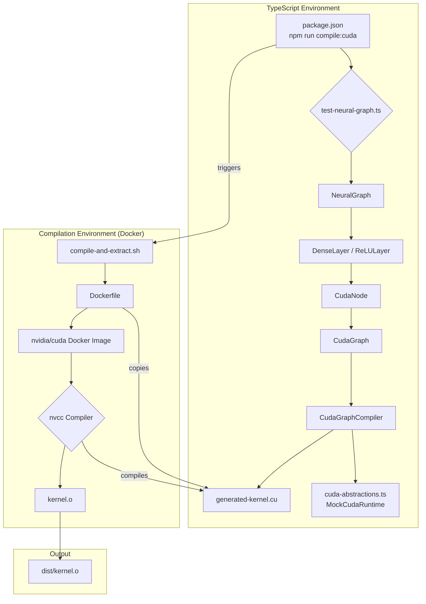

# Adaptive Node Graph to CUDA Compiler

This project demonstrates a sophisticated system for defining a computation graph (specifically, a neural network) in TypeScript, compiling it down to a single, fused CUDA C++ kernel, and then compiling that kernel into a binary object file using Docker and `nvcc`.

## Architecture

The architecture is designed to be modular and extensible, separating the high-level graph definition from the low-level CUDA execution details.



### Key Components

#### 1. TypeScript Graph Definition (`src/`)

-   **`neural-network.ts`**: Provides high-level abstractions for building neural networks.
    -   `NeuralGraph`: A specialized `CudaGraph` that simplifies adding layers sequentially.
    -   `Layer` (Interface): A contract for neural network layers (e.g., `DenseLayer`, `ReLULayer`). Each layer is responsible for creating and configuring its corresponding `CudaNode`.
-   **`cuda-graph.ts`**: The core of the graph engine.
    -   `CudaNode`: Represents a single, generic operation in the graph. It contains a snippet of CUDA device code, named inputs/outputs, and parameters.
    -   `CudaGraph`: A generic Directed Acyclic Graph (DAG) of `CudaNode`s. It manages nodes and the connections between them.
    -   `CudaGraphCompiler`: The "brains" of the operation. It takes a `CudaGraph`, performs a topological sort to determine execution order, and then "fuses" all the `CudaNode` device code into a single, monolithic CUDA kernel. It also performs liveness analysis to manage and reuse memory for intermediate tensors, minimizing the kernel's memory footprint.
-   **`cuda-abstractions.ts`**: Decouples the TypeScript logic from the native CUDA runtime.
    -   `CudaRuntime` (Interface): Defines the contract for all GPU operations (compiling, memory allocation, data transfer).
    -   `MockCudaRuntime`: A TypeScript-only implementation of the `CudaRuntime` interface. It allows for development, testing, and kernel generation without needing a native C++ addon or a physical GPU. It logs operations to the console, simulating the behavior of a real CUDA runtime.

#### 2. CUDA Kernel Generation

-   **`test-neural-graph.ts`**: This script acts as the entry point. It:
    1.  Instantiates the `MockCudaRuntime`.
    2.  Builds a `NeuralGraph` by adding `DenseLayer` and `ReLULayer` instances.
    3.  Invokes the `CudaGraphCompiler` to generate the CUDA C++ source code.
    4.  Saves this source code to `generated-kernel.cu`.

#### 3. CUDA Compilation Workflow

-   **`compile-and-extract.sh`**: This shell script orchestrates the final compilation step.
    1.  It invokes `docker build`.
    2.  The `--output` flag is used to instruct Docker to copy the final compiled artifact from the Docker image back to the host's `dist/` directory.
-   **`Dockerfile`**: A multi-stage Dockerfile ensures a clean and reproducible build environment.
    -   **Stage 1 (builder)**: Uses the official `nvidia/cuda` image, which comes with the `nvcc` compiler. It copies `generated-kernel.cu` into the image and compiles it into an object file (`kernel.o`).
    -   **Stage 2 (final)**: Starts from a minimal `scratch` image and copies *only* the `kernel.o` file from the builder stage. This makes the final image extremely small and clean.

## Workflow: From TypeScript to Binary

The entire process is kicked off by a single command:

```bash
npm run compile:cuda
```

Here is a step-by-step breakdown of what happens:

1.  **`npm run test-neural-graph`**:
    -   `esbuild` transpiles and bundles `src/cuda-work/test-neural-graph.ts`.
    -   The resulting JavaScript is executed by Node.js.
    -   A `NeuralGraph` is constructed in memory.
    -   The `CudaGraphCompiler` traverses the graph and generates the source code for a single, fused CUDA kernel.
    -   This code is written to the `generated-kernel.cu` file at the project root.

2.  **`./compile-and-extract.sh`**:
    -   Docker is invoked to build the project according to the `Dockerfile`.
    -   Inside the Docker container, `nvcc` compiles `generated-kernel.cu` into `kernel.o`.
    -   The `docker build --output` command extracts `kernel.o` from the final Docker image stage and places it into the `./dist/` directory on the host machine.

The final result is a compiled CUDA binary object file, `dist/kernel.o`, ready to be linked into a larger application or executed by a native CUDA host program.
